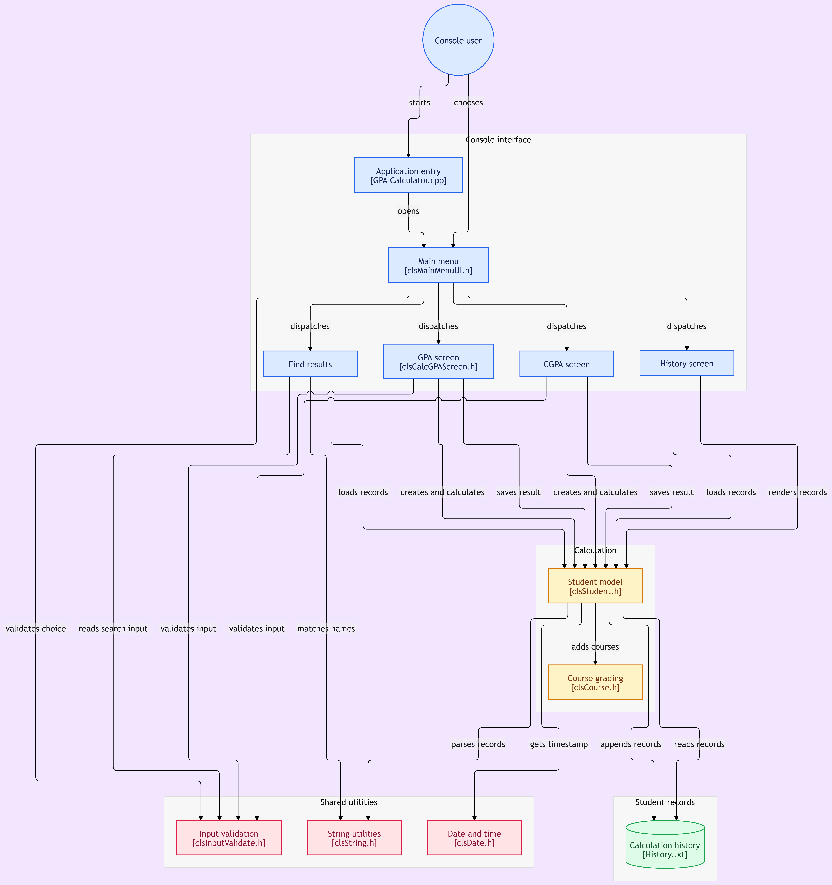

# 🎓 GPA Calculator — Student Academic Management System

A console-based C++ application for calculating and tracking student GPA and CGPA, with persistent history storage and student result lookup — built entirely from an original idea using Object-Oriented Programming.

---

## 📋 Overview

Unlike course-guided projects, this system was designed and built independently to solve a real, personal need: calculating semester GPA and cumulative CGPA while keeping a searchable history of past calculations. It evolved from a simple single-class calculator into a full multi-screen application with file-based data persistence.

---

## ✨ Features

**GPA Calculation**
- Add multiple courses with credit hours and marks
- Automatic grade assignment (A+ through F) based on a standard grading scale
- Semester GPA computed on a 4.0 scale

**CGPA Calculation**
- Factors in previous cumulative GPA and previous credit hours
- Computes updated cumulative GPA alongside the current semester's GPA

**Records & History**
- Every calculation is automatically saved to a persistent history file
- Browse the full calculation history across all students
- Search and retrieve a specific student's past results by name (case-insensitive)

**Reporting**
- Clean, formatted academic report card for each calculation
- Displays highest-scoring course, semester GPA, and cumulative CGPA
- Full history table with date/time, name, year, GPA, CGPA, and top course per record

---

## 🏗️ Architecture & OOP Concepts

| Concept | Application |
|---|---|
| **Encapsulation** | Student and course data are private, exposed only through controlled methods |
| **Inheritance** | `clsCalcCGPAScreen` inherits from `clsCalcGPAScreen` to reuse shared course-entry logic |
| **Templates** | Generic `ReadNumber<T>()` / `ReadNumberBetween<T>()` validate input across multiple numeric types without duplicated code |
| **Serialization** | Custom object-to-line and line-to-object conversion for file-based history storage |
| **Separation of Concerns** | Each screen (Calculate GPA, Calculate CGPA, Find Result, Show History) is its own class, fully decoupled from data logic |
| **Static Utility Classes** | Reusable helpers (`clsString`, `clsInputValidate`) provide validation and string manipulation without needing object instantiation |

## 🏛️ System Architecture Diagram

Click the diagram to explore the interactive visual architecture:

[](https://gitdiagram.com/baraaelgendy/gpa-calculator)

---

## 📁 Project Structure

```
├── clsCourse.h                  # Course entity: name, hours, marks, grade calculation
├── clsStudent.h                 # Student entity: GPA/CGPA logic, file I/O, report printing
├── clsString.h                  # String manipulation utility library
├── clsInputValidate.h           # Generic, template-based input validation
├── clsDate.h                    # Date/time utility
├── clsCalcGPAScreen.h           # Screen: calculate semester GPA
├── clsCalcCGPAScreen.h          # Screen: calculate CGPA (inherits from clsCalcGPAScreen)
├── clsFindStudentResults.h      # Screen: search history by student name
├── clsShowAllHistoryScreen.h    # Screen: display full calculation history
├── clsMainMenuUI.h              # Main menu navigation
├── History.txt                 # Persisted calculation records
└── GPA_Calculator.cpp           # Entry point
```

---

## 🛠️ Tech Stack

- **Language:** C++
- **IDE:** Microsoft Visual Studio
- **Version Control:** Git & GitHub

---

## 🚀 Getting Started

```bash
git clone https://github.com/BaraaElgendy/GPA-Calculator.git
```

Open `GPA_Calculator.slnx` in Visual Studio and build/run the solution.

---

## 💡 Why This Project

This project wasn't assigned — it was built to solve a problem the developer actually has as a student: keeping track of GPA calculations across semesters. It served as a hands-on way to apply OOP concepts (inheritance, templates, file persistence) learned from coursework to an original, self-directed idea.

---

## 📌 Status

Actively maintained — new features and refinements are added as the project's data structures and validation logic are extended.

